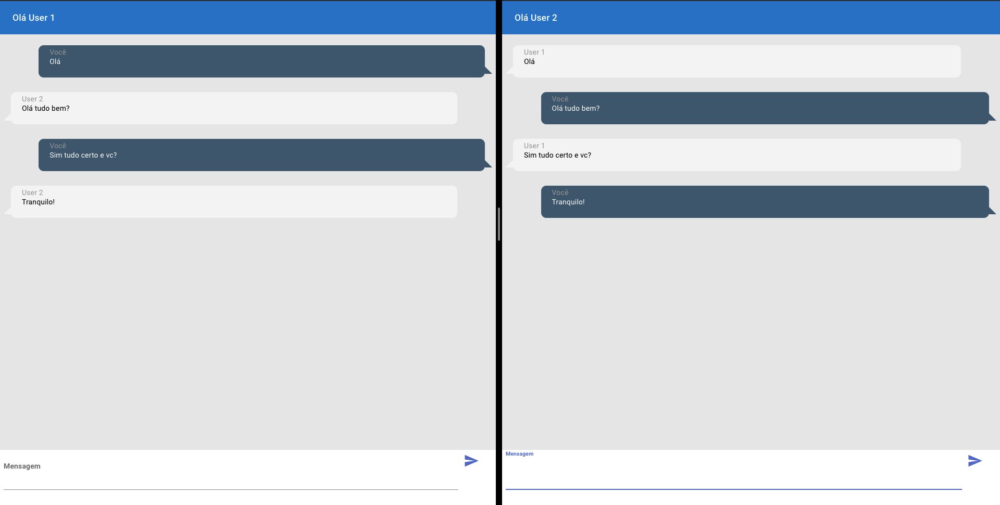

# Websocket frontend

- Projeto de um simples chat que exibe o status se os usuários das demais pontas estão digitando, bem como troca de mensagens em real-time

- [Backend](https://github.com/mrcarromesa/serverless-aws/websocket)

- Antes de realizar o deploy, criar o arquivo `.env` com base no `.env.example` e ajustar a variavel `REACT_APP_WEBSOCKET_URL` colocando o endereço do seu webhook, para
tal só copiar o endpoint gerado do projeto [Backend](https://github.com/mrcarromesa/serverless-aws/websocket)

## Projeto em funcionamento:

