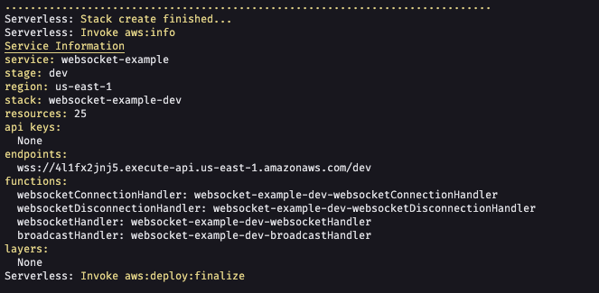

# Serverless - Websocket

---

## O que é o projeto

- Projeto de um simples chat que exibe o status se os usuários das demais pontas estão digitando, bem como troca de mensagens em real-time

- [Frontend](https://github.com/mrcarromesa/serverless-aws/websocket-frontend)

## Detalhes sobre a estrutura do projeto

- Para verificar mais detalhes sobre a estrutura do projeto acesse: [Serverless com alguns recursos aws](../README.md)

## Como testar

- Realizar deploy desse projeto, e utilizar o [Frontend](https://github.com/mrcarromesa/serverless-aws/websocket-frontend), para testar

## WEBSOCKET - Configuração necessária no serverless.ts

- Esse projeto não utiliza apis mas sim comunicação via websocket:

```ts
functions: {
    websocketConnectionHandler: {
      tags: {
        function: 'websocket-example-websocket-connection-handler',
      },
      role: 'LambdaRole',
      handler: 'src/websocket.connectHandler', // Função será chamada quando houver uma nova conexão
      events: [
        {
          websocket: {
            route: '$connect',
          },
        },
      ],
    },
    websocketDisconnectionHandler: {
      tags: {
        function: 'websocket-example-websocket-disconnection-handler',
      },
      role: 'LambdaRole',
      handler: 'src/websocket.disconnectHandler', // Função será chamada quando alguém for disconectado
      events: [
        {
          websocket: {
            route: '$disconnect',
          },
        },
      ],
    },
    websocketHandler: {
      tags: {
        function: 'websocket-example-websocket-handler',
      },
      role: 'LambdaRole',
      handler: 'src/websocket.defaultHandler', // Função será chamada nas demais situações como para receber/disparar mensagens
      events: [
        {
          websocket: {
            route: '$default',
          },
        },
      ],
    },
    //
},
```

- Os usuários conectados serão armazenados na tabela `Websocket` do dynamodb, para tal utilizamos o resource:

```ts
{
  Effect: 'Allow',
  Action: [
    'dynamodb:GetItem',
    'dynamodb:PutItem',
    'dynamodb:DeleteItem',
    'dynamodb:Scan',
    'dynamodb:UpdateItem',
    'dynamodb:DescribeTable',
    'dynamodb:CreateTable',
    'dynamodb:BatchWriteItem',
    'dynamodb:DescribeTimeToLive',
    'dynamodb:UpdateTimeToLive',
    'dynamodb:Delete',
    'dynamodb:Update',
    'dynamodb:ListStreams',
  ],
  Resource: 'arn:aws:dynamodb:us-east-1:*:table/Websocket',
},
```

---

- Após realizar o deploy:

```shell
serverless deploy dev
```

- será exibido o endpoint do websocket:



só copiar o endpoint que aparecer para vc após realizar o seu deploy, e começar a realizar as chamadas, utilizando o projeto [Frontend](https://github.com/mrcarromesa/serverless-aws/websocket-frontend)
